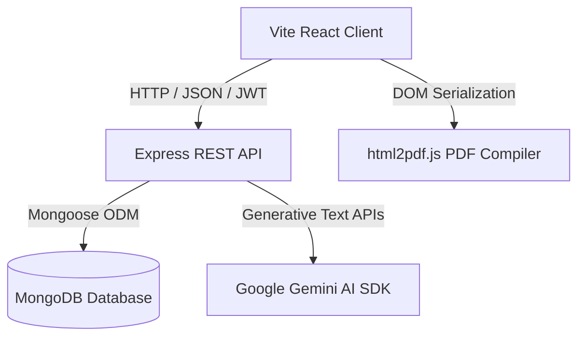

# ResumeAI — AI Powered Resume Builder

ResumeAI is a modern, high-fidelity full-stack web application that empowers users to create, customize, and export professional, ATS-optimized resumes. Utilizing artificial intelligence, the platform can draft career profiles, improve experience bullet descriptions, suggest technical skills, and swap layouts in real time.

---

## Technical Architecture



---

## Core Features

- **Robust Session Security**: Password hashing with `bcryptjs` and request state validation with JSON Web Tokens (JWT).
- **Auto-Save Workspaces**: Changes made on the multi-step editor are saved in real-time to MongoDB using a debounced 1.5s client sync mechanism.
- **AI-Powered Copilot Panel**:
  - Automatically draft a profile summary or career objective matching the target role.
  - Suggest highly relevant technical and soft skills corresponding to the job title.
  - Inline "AI Rewrite" widgets to polish grammar and increase impact.
- **Multiple Custom Layouts**: Select between 5 professional templates (**Modern**, **ATS-Friendly**, **Corporate**, **Creative**, and **Minimal**) on-the-fly.
- **Visual Accent Tuning**: Adjust primary branding colors, document typography (sans-serif, display, serif, mono), and layout density.
- **Unified Administrative Center**:
  - Interactive SVG charts mapping monthly growth and template design popularity.
  - Searchable user directory with cascaded profile deletion capabilities.

---

## Technology Stack

### Frontend
- **Framework**: React 19 (via Vite)
- **Styling**: Tailwind CSS v4, Framer Motion (for premium micro-animations)
- **Routing**: React Router DOM v6
- **Notifications**: React Hot Toast
- **PDF Compilation**: `html2pdf.js` (DOM canvas layout capturing)

### Backend
- **Runtime Environment**: Node.js & Express (ES Modules)
- **Database Engine**: MongoDB (via Mongoose ODM)
- **Session Authentication**: JWT & bcryptjs
- **Media Uploads**: Multer (profile picture attachments)
- **AI SDK**: Google Generative AI (`@google/generative-ai`)

---

## Installation & Local Setup

### Prerequisites
- Node.js (v18+)
- MongoDB running locally on `mongodb://localhost:27017` (or a MongoDB Atlas Connection String)

### Step 1: Clone and Configure Environment Files
In the `server/` directory, configure your `.env` file:
```env
PORT=5000
MONGO_URI=mongodb://localhost:27017/resume_ai
JWT_SECRET=super_secret_resume_ai_key_12345
GEMINI_API_KEY=YOUR_GEMINI_API_KEY_HERE
NODE_ENV=development
```

### Step 2: Install and Start Backend
Open a terminal in the `/server` directory and run:
```bash
# Install dependencies
npm install

# Start the dev server in watch mode
npm run dev
```
The server will boot on [http://localhost:5000](http://localhost:5000).

### Step 3: Install and Start Frontend
Open another terminal in the root directory and run:
```bash
# Install dependencies
npm install

# Run Vite dev server
npm run dev
```
The client dashboard will boot on [http://localhost:5173](http://localhost:5173).

---

## Database Schema Model Design

### User Model
```json
{
  "_id": "ObjectId",
  "name": "String",
  "email": "String (Unique)",
  "password": "String (Hashed)",
  "profileImage": "String (URL Path)",
  "role": "String (user / admin)",
  "createdAt": "Date",
  "updatedAt": "Date"
}
```

### Resume Model
```json
{
  "_id": "ObjectId",
  "userId": "ObjectId (ref: User)",
  "title": "String",
  "personalInfo": {
    "fullName": "String",
    "email": "String",
    "phone": "String",
    "location": "String",
    "website": "String",
    "github": "String",
    "linkedin": "String",
    "jobTitle": "String",
    "summary": "String"
  },
  "education": [
    {
      "school": "String",
      "degree": "String",
      "fieldOfStudy": "String",
      "startDate": "String",
      "endDate": "String",
      "description": "String",
      "current": "Boolean"
    }
  ],
  "skills": [
    {
      "name": "String",
      "level": "String"
    }
  ],
  "experience": [
    {
      "company": "String",
      "position": "String",
      "location": "String",
      "startDate": "String",
      "endDate": "String",
      "description": "String",
      "current": "Boolean"
    }
  ],
  "projects": [
    {
      "name": "String",
      "description": "String",
      "technologies": "String",
      "link": "String"
    }
  ],
  "certifications": [
    {
      "name": "String",
      "issuer": "String",
      "date": "String",
      "link": "String"
    }
  ],
  "achievements": [
    {
      "title": "String",
      "description": "String"
    }
  ],
  "languages": [
    {
      "language": "String",
      "proficiency": "String"
    }
  ],
  "template": "String (modern / ats / corporate / creative / minimal)",
  "theme": {
    "primaryColor": "String (HEX)",
    "fontFamily": "String",
    "spacing": "String (compact / normal / loose)"
  }
}
```

---

## API Documentation

### Auth Module (`/api/auth`)
- `POST /register` — Register a new account.
- `POST /login` — Access existing account.
- `GET /profile` — Retrieve account parameters (Private).
- `PUT /profile` — Update basic credentials and upload profile image (Private).

### Resume Module (`/api/resumes`)
- `POST /` — Initialize a new resume draft (Private).
- `GET /my-resumes` — Load all resumes owned by the session user (Private).
- `GET /:id` — Load specific resume details (Private/Owner check).
- `PUT /:id` — Debounce updates to resume parameters (Private/Owner check).
- `DELETE /:id` — Remove specific resume (Private/Owner/Cascade check).

### AI Service Module (`/api/ai`)
- `POST /generate-summary` — Formulate professional resume summary (Private).
- `POST /generate-objective` — Formulate career objective target (Private).
- `POST /improve-content` — Clean syntax, fix grammar, and polish bullets (Private).
- `POST /suggest-skills` — List core competencies based on title (Private).

### Administrative Controller (`/api/admin`)
- `GET /users` — Get list of system user accounts (Admin Only).
- `GET /analytics` — Summarize template counts and monthly growth charts (Admin Only).
- `DELETE /users/:id` — Perform cascaded profile and resume deletions (Admin Only).

---

## Deployment Guide

### Database
Sign up for a free tier database cluster on **MongoDB Atlas**, whitelist IP addresses, and copy the Connection String URI into the `.env` configuration file on deployment.

### Backend (Express) on Render
1. Create a Web Service linked to your Git Repository.
2. Select runtime **Node**.
3. Set Build Command: `cd server && npm install`
4. Set Start Command: `cd server && npm start`
5. Inject Environment Variables matching the backend `.env` keys.

### Frontend (Vite React) on Vercel
1. Create a Project linked to your Git Repository.
2. Set Framework Preset: **Vite**.
3. Set Root Directory: `./` (or leave default root).
4. Set Environment Variables: `VITE_API_URL` to point to your live Render Backend (e.g., `https://your-backend.onrender.com/api`).
5. Trigger build. Vercel automatically deploys the static files.
